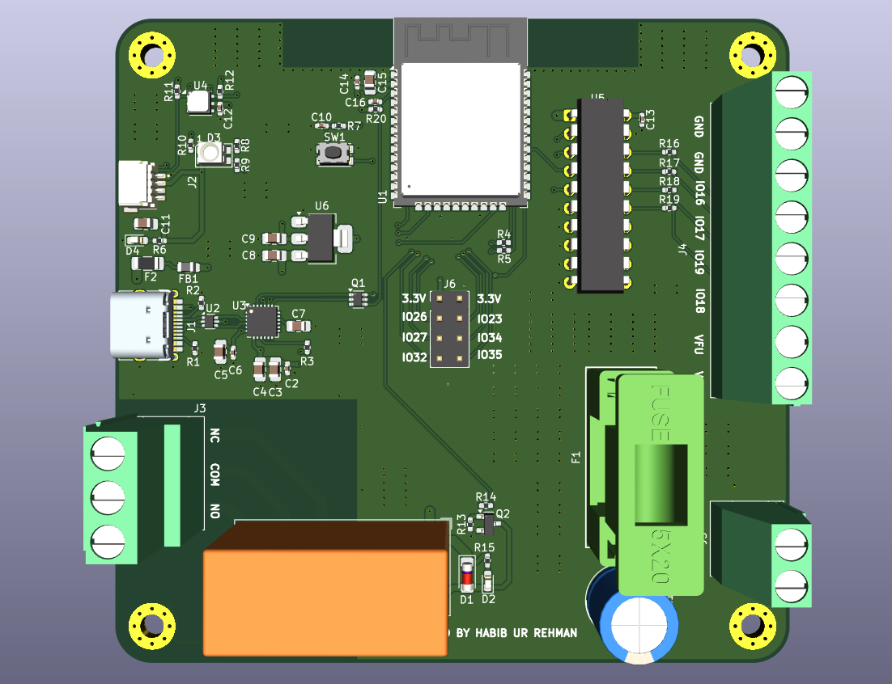
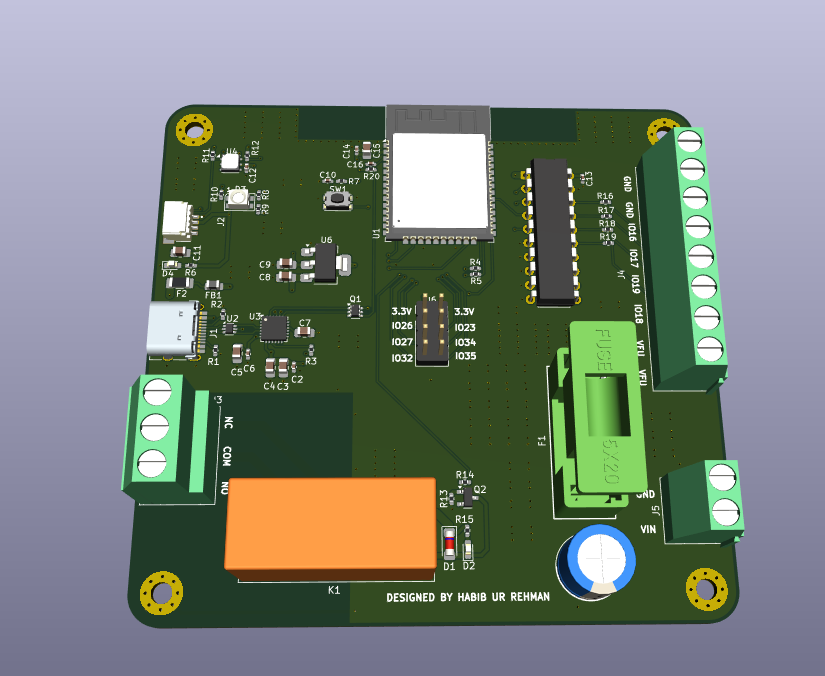
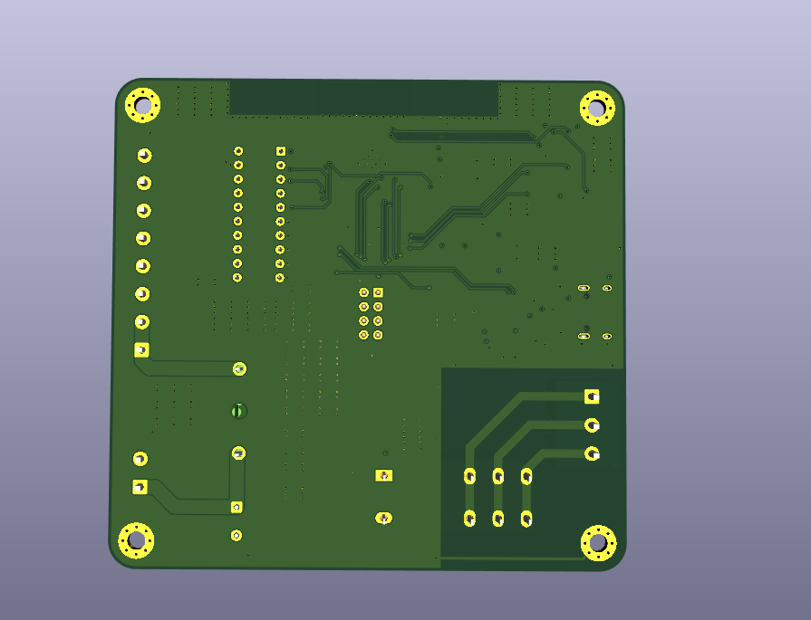
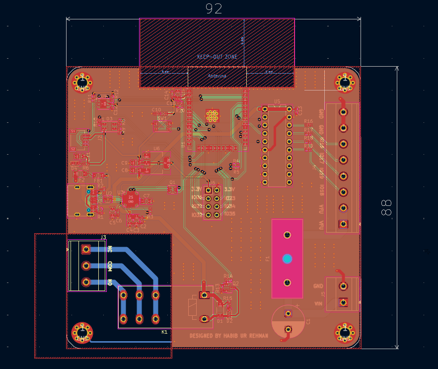
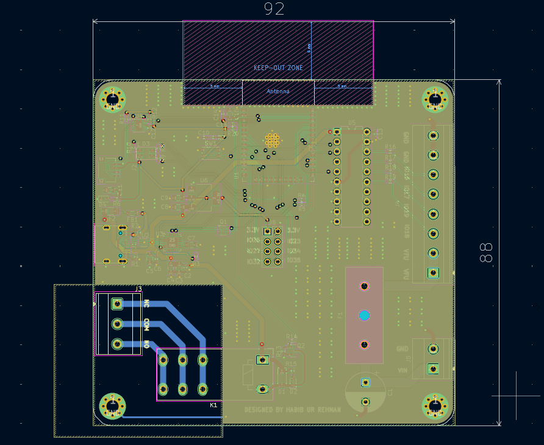
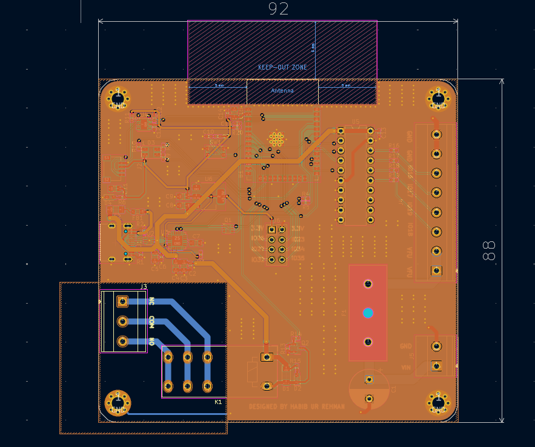
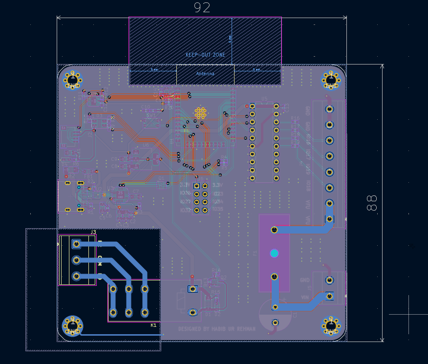
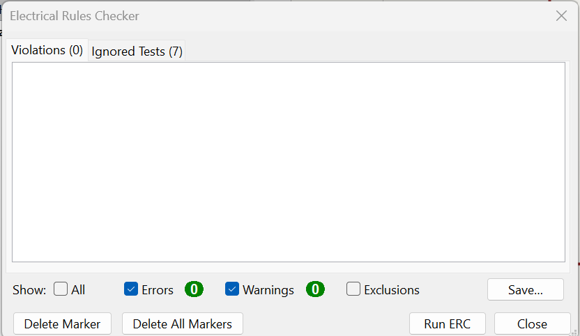
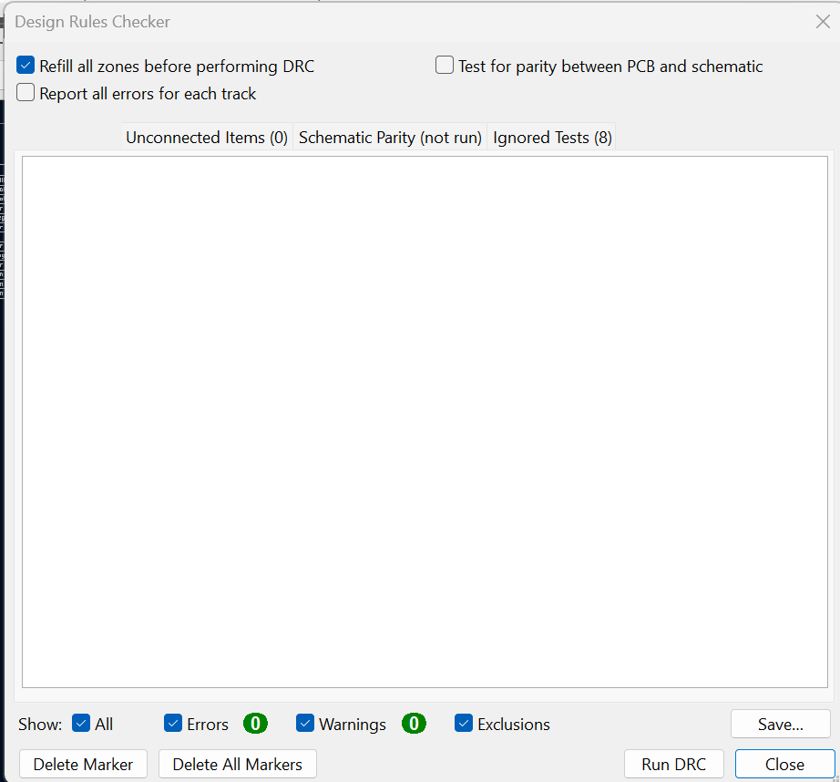

# 4-Layer ESP32 IoT Monitoring and Control Board

<p align="center">
  
</p>

<p align="center">
  <strong>ESP32-WROOM-32D • Si7021 • Relay • USB • Qwiic • 4-Layer PCB</strong>
</p>

<p align="center">
  A custom 4-layer ESP32-based hardware platform integrating environmental
  sensing, wired connectivity, relay control, USB programming, and
  expansion interfaces.
</p>

<p align="center">
  <a href="docs/IOT_Schematic.pdf">Schematic</a> •
  <a href="bom/IOT_BOM.csv">BOM</a> •
  <a href="manufacturing/gerbers/">Gerbers</a> •
  <a href="hardware/kicad/">KiCad Files</a>
</p>

---

## Overview

The **4-Layer ESP32 IoT Monitoring and Control Board** is a custom
embedded hardware platform built around the **ESP32-WROOM-32D** module.

The board combines environmental sensing through the **Si7021-A20**,
serial and wired interfaces, relay control, USB connectivity, Qwiic
expansion, and general-purpose GPIO in a compact 4-layer PCB design.

The complete hardware package is included in this repository, covering
the native **KiCad project**, electrical schematic, PCB layout, BOM,
Gerber and drill manufacturing files, pick-and-place data, and PCB
documentation.

> **Status:** Design files and manufacturing outputs included.

---

## Quick Access

| Resource | Description |
|---|---|
|  [Schematic PDF](docs/IOT_Schematic.pdf) | Complete electrical schematic |
|  [Bill of Materials](bom/IOT_BOM.csv) | Component BOM |
|  [Gerber & Drill Files](manufacturing/gerbers/) | PCB manufacturing outputs |
|  [KiCad Project](hardware/kicad/) | Native KiCad design files |
|  [PCB Images](docs/images/) | 3D renders and layer views |
|  [Pick-and-Place Data](manufacturing/pick-and-place/) | Component placement data |
|  [ERC / DRC Reports](docs/images/) | Design verification screenshots |

---

## Key Features

| Feature | Details |
|---|---|
| **Main Controller** | ESP32-WROOM-32D |
| **Environmental Sensor** | Si7021-A20 |
| **Sensor Interface** | I²C |
| **Serial / Expansion** | UART / GPIO |
| **Relay Control** | RT314A05 relay |
| **USB** | USB 2.0 Type-C interface |
| **Expansion** | Qwiic connector |
| **PCB** | 4-layer PCB |
| **EDA Software** | KiCad |
| **Manufacturing Data** | Gerber + PTH/NPTH drill files |
| **Assembly Data** | Top and bottom pick-and-place files |

---

## PCB Preview

### 3D Board Render

<p align="center">
  
</p>

### Alternative 3D View

<p align="center">
  
</p>

### Bottom 3D View

<p align="center">
  
</p>

---

## PCB Layer Views

### Front Copper / Layout

<p align="center">
  
</p>

### Inner Layer 1

<p align="center">
  
</p>

### Inner Layer 2

<p align="center">
  
</p>

### Bottom Layer

<p align="center">
  
</p>

---

## Hardware Architecture

The design brings together several functional blocks around the ESP32
controller.

### ESP32-WROOM-32D

The **ESP32-WROOM-32D** provides the primary processing and wireless
connectivity platform for the board.

### Environmental Sensing

The **Si7021-A20** provides digital environmental sensing through an
I²C interface.

### Relay Control

A **RT314A05 relay** provides a dedicated switched-output function with
associated transistor drive circuitry.

### USB and Programming

The board includes a **USB Type-C USB 2.0 interface** and associated
USB interface circuitry.

### Qwiic Expansion

A **Qwiic connector** provides an additional I²C expansion interface.

---

## PCB Design

The board is implemented as a **4-layer PCB** using **KiCad**.

### PCB Characteristics

- 4-layer PCB architecture
- ESP32-WROOM-32D module
- Environmental sensor interface
- Relay control circuitry
- USB Type-C interface
- Qwiic expansion
- Dedicated internal copper layers
- Compact component placement
- Through-hole and surface-mount components
- PTH and NPTH manufacturing data

---

## Design Files

The native KiCad project is located in:

[**hardware/kicad/**](hardware/kicad/)

### Main Files

| File | Description |
|---|---|
| `IOT.kicad_pro` | KiCad project |
| `IOT.kicad_sch` | Schematic source |
| `IOT.kicad_pcb` | PCB layout |

---

## Schematic

The exported electrical schematic is available as:

###  [View IOT Schematic PDF](docs/IOT_Schematic.pdf)

The schematic documents the ESP32 controller, environmental sensor,
USB interface, relay control, Qwiic interface,
power circuitry, and associated support components.

---

## Bill of Materials

The current component BOM is available here:

###  [View / Download IOT BOM](bom/IOT_BOM.csv)

The BOM contains the component references, quantities, values,
footprints, and associated component information from the design.

---

## Manufacturing Outputs

The generated manufacturing package is available under:

###  [Gerber & Drill Files](manufacturing/gerbers/)

The package contains:

- Front copper
- Back copper
- Inner copper layer 1
- Inner copper layer 2
- Front solder mask
- Back solder mask
- Front silkscreen
- Back silkscreen
- Front solder paste
- Back solder paste
- Board outline
- PTH drill data
- NPTH drill data
- Gerber job file

---

## Pick-and-Place Data

Assembly placement data is available in:

[**manufacturing/pick-and-place/**](manufacturing/pick-and-place/)

The repository contains separate top-side and bottom-side component
placement files.

---

## Design Verification

Design verification artifacts included with the project:

### ERC

<p align="center">
  
</p>

### DRC

<p align="center">
  
</p>

---

## Project Status

| Item | Status |
|---|---|
| Schematic | ✅ Completed |
| PCB Layout | ✅ Completed |
| PCB Layer Count | ✅ 4-layer |
| KiCad Project | ✅ Included |
| BOM | ✅ Included |
| Gerber Files | ✅ Generated |
| Drill Files | ✅ Generated |
| Pick-and-Place Data | ✅ Included |
| ERC Documentation | ✅ Included |
| DRC Documentation | ✅ Included |
| PCB Documentation | ✅ Included |

---

## Repository Structure

```text
.
├── hardware/
│   └── kicad/
│       ├── IOT.kicad_pro
│       ├── IOT.kicad_sch
│       └── IOT.kicad_pcb
│
├── manufacturing/
│   ├── gerbers/
│   │   ├── IOT-F_Cu.gbr
│   │   ├── IOT-In1_Cu.gbr
│   │   ├── IOT-In2_Cu.gbr
│   │   ├── IOT-B_Cu.gbr
│   │   ├── IOT-F_Mask.gbr
│   │   ├── IOT-B_Mask.gbr
│   │   ├── IOT-F_Silkscreen.gbr
│   │   ├── IOT-B_Silkscreen.gbr
│   │   ├── IOT-F_Paste.gbr
│   │   ├── IOT-B_Paste.gbr
│   │   ├── IOT-Edge_Cuts.gbr
│   │   ├── IOT-PTH.drl
│   │   ├── IOT-NPTH.drl
│   │   └── IOT-job.gbrjob
│   │
│   └── pick-and-place/
│       ├── IOT-top.pos
│       └── IOT-bottom.pos
│
├── bom/
│   └── IOT_BOM.csv
│
├── docs/
│   ├── images/
│   │   ├── 3D_front_1.png
│   │   ├── 3D_front_2.png
│   │   ├── 3D_BACK.png
│   │   ├── Layout_front_layer.png
│   │   ├── Layout_inner_layer_1.png
│   │   ├── Layout_inner_layer_2.png
│   │   ├── Layout_Bottom_layer.png
│   │   ├── ERC.png
│   │   └── DRC.png
│   │
│   └── IOT_Schematic.pdf
│
├── .gitignore
├── CONTRIBUTING.md
├── LICENSE
└── README.md
```

---

## Acknowledgements

This repository contains the hardware design package for the
4-Layer ESP32 IoT Monitoring and Control Board.

The repository includes the native KiCad source files together with
the associated schematic, PCB documentation, BOM, manufacturing
outputs, and assembly data.

---

## Contributing

Contributions, design reviews, and hardware improvements are welcome.

For proposed revisions, keep the native KiCad design files and
associated documentation aligned with the corresponding hardware
revision.

---

## License

The hardware design files in this repository are licensed under the
**CERN Open Hardware Licence Version 2 - Strongly Reciprocal
(CERN-OHL-S-2.0)**.

The CERN-OHL-S-2.0 licence is a hardware-specific open-source licence
for sharing, modifying, and distributing covered hardware designs.

**Copyright © 2026 Habib Ur Rehman**

See [`LICENSE`](LICENSE) for the licence information associated with
this repository.

---

## Author

### Habib Ur Rehman

**Electronics Engineering**

Embedded systems, PCB design, microcontrollers, electronics hardware,
and hardware development.

### Connect

- **GitHub:** [Habib-creater](https://github.com/Habib-creater)
- **LinkedIn:** [Habib Ur Rehman](https://www.linkedin.com/in/habib-ur-rehman-8321182b4/)

---

<p align="center">
  <strong>4-Layer ESP32 IoT Monitoring and Control Board</strong><br>
  Custom ESP32 Embedded Hardware Platform
</p>
